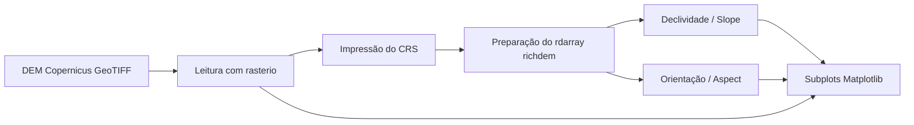

<div align="center">

# 🐝 BeeSpace — Análise Topográfica para Microclimas

### DEM Copernicus • Declividade • Orientação da Encosta • Instalação de Colmeias


</div>

---

## 🌄 Objetivo da Seção

Esta seção do **BeeSpace** usa um **Modelo Digital de Elevação (DEM) do Copernicus** para avaliar características topográficas que influenciam o microclima ao redor das colmeias.

O código principal está em:

```text
JupyterLab/Análise Topográfica para Microclimas (DEM)
```

Ele foi preparado para ser executado em **uma única célula do JupyterLab** e gera três mapas lado a lado:

1. **DEM original** — elevação do terreno;
2. **Declividade / Slope** — inclinação do terreno;
3. **Orientação da Encosta / Aspect** — direção da encosta e potencial incidência solar.

---

## 🧭 Por que isso importa para as colmeias?

A escolha do local de instalação das colmeias depende de fatores ambientais que podem variar bastante em pequenas distâncias. A topografia ajuda a entender:

| Variável | Como ajuda a BeeSpace |
|---|---|
| **Elevação** | Indica diferenças de altitude que podem afetar temperatura, umidade e exposição ao vento. |
| **Declividade** | Ajuda a identificar áreas íngremes, corredores de vento, escoamento superficial e dificuldade de acesso. |
| **Orientação da Encosta** | Ajuda a inferir maior ou menor incidência solar ao longo do dia, afetando aquecimento e microclima. |

---

## 🧪 Bibliotecas Utilizadas

```python
import rasterio
import richdem as rd
import matplotlib.pyplot as plt
```

Também é usado `numpy` para manipular máscaras `NoData` e preparar os arrays para visualização.

### Instalação recomendada

```bash
pip install rasterio richdem matplotlib numpy
```

> Se `richdem` não estiver disponível no ambiente, uma alternativa técnica é adaptar o notebook para `xarray-spatial`, mas esta seção foi escrita usando `richdem`.

---

## 📁 Estrutura Recomendada

```text
BeeSpace/
└── JupyterLab/
    ├── Análise Topográfica para Microclimas (DEM)
    ├── REDME.md
    └── dados/
        └── Copernicus_DEM_area_colmeias.tif
```

No script, ajuste esta linha para apontar para o seu arquivo real:

```python
CAMINHO_DEM = Path("./dados/Copernicus_DEM_area_colmeias.tif")
```

---

## 🛰️ Fluxo de Processamento



---

## ✅ Validações incluídas no código

- Lê o DEM como uma matriz mascarada para respeitar pixels `NoData`;
- Imprime o **CRS** do arquivo para conferência espacial;
- Imprime resolução, dimensão e valor `NoData`;
- Alerta quando o DEM está em CRS geográfico, pois declividade é mais precisa em CRS projetado em metros;
- Mantém áreas sem dados como `NaN` na visualização;
- Remove orientação de encosta indefinida em áreas planas.

---

## 🎨 Saída Esperada

O notebook gera uma figura com três painéis:

| Painel | Colormap | Uso |
|---|---|---|
| **DEM** | `terrain` | Visualizar altitude e relevo geral |
| **Declividade** | `magma` | Destacar encostas e possíveis corredores de vento |
| **Orientação da Encosta** | `twilight_shifted` | Representar direções de exposição solar em escala circular |

---

## 🐝 Interpretação para Decisão BeeSpace

Locais mais adequados para instalação de colmeias tendem a combinar:

- declividade baixa a moderada, facilitando acesso e estabilidade;
- menor exposição a corredores de vento intenso;
- boa incidência solar matinal, dependendo do clima local;
- distância segura de áreas de acúmulo de água ou erosão;
- proximidade com áreas de forrageamento e vegetação saudável.

> A análise topográfica deve ser combinada com NDVI, dados meteorológicos, sensores IoT das colmeias e validação em campo.

---

<div align="center">

## 🌎 BeeSpace

**Sensoriamento remoto + IoT + biodiversidade para apoiar a apicultura inteligente**

🐝 Colmeias inteligentes • 🌿 Microclima • 🛰️ Copernicus DEM • 📍 Geoprocessamento

</div>
