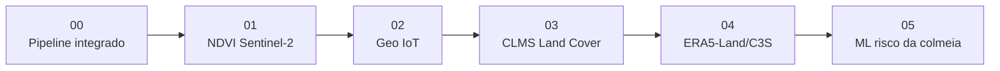

<div align="center">

# 🐝 BeeSpace · Código Roger

### Notebooks Copernicus + Geo-IoT + Machine Learning para apicultura inteligente


**Seis notebooks demonstrativos para transformar colmeias georreferenciadas em sensores vivos de biodiversidade, combinando dados orbitais simulados, telemetria local e modelos preditivos.**

</div>

---

## ✨ Visão geral

Este diretório reúne uma trilha prática para apresentar a proposta BeeSpace dentro do JupyterLab. Cada notebook usa **dados sintéticos** para demonstrar uma parte da arquitetura: indicadores de vegetação, área de voo das abelhas, cobertura do solo, clima, telemetria de colmeia e classificação de risco.

> ⚠️ **Importante:** os notebooks são uma prova de conceito. Em produção, os dados simulados devem ser substituídos por fontes reais, como Copernicus Data Space Ecosystem, Copernicus Land Monitoring Service, ERA5-Land/C3S, sensores IoT, visão computacional, bioacústica e registros de campo.

---

## 🧭 Trilha recomendada



| Ordem | Notebook | Papel na solução | Resultado principal |
|---:|---|---|---|
| 1 | [`00_beespace_pipeline_integrado.ipynb`](00_beespace_pipeline_integrado.ipynb) | Demonstra a jornada completa do MVP | Base integrada, score e alerta por colmeia |
| 2 | [`01_ndvi_sentinel2_beespace.ipynb`](01_ndvi_sentinel2_beespace.ipynb) | Mede vigor vegetal simulado com NDVI | Mapa NDVI e estatísticas de vegetação |
| 3 | [`02_geo_iot_colmeias.ipynb`](02_geo_iot_colmeias.ipynb) | Localiza colmeias e estima área potencial de biovigilância | CSV georreferenciado e mapa Folium opcional |
| 4 | [`03_clms_landcover_beespace.ipynb`](03_clms_landcover_beespace.ipynb) | Avalia uso e cobertura do solo no entorno | Score de qualidade ambiental do entorno |
| 5 | [`04_era5_climate_beespace.ipynb`](04_era5_climate_beespace.ipynb) | Simula clima e eventos de seca/estresse | Série temporal climática e gráficos |
| 6 | [`05_ml_risco_colmeia_beespace.ipynb`](05_ml_risco_colmeia_beespace.ipynb) | Treina classificador de risco da colmeia | Modelo Random Forest e artefatos de predição |

---

## 📒 Explicação de cada notebook

### 00 · Pipeline integrado BeeSpace

**Arquivo:** [`00_beespace_pipeline_integrado.ipynb`](00_beespace_pipeline_integrado.ipynb)

Este notebook funciona como a apresentação executiva da solução. Ele começa criando colmeias georreferenciadas, calcula a área potencial de biovigilância com raio de voo de 3 km e integra variáveis ambientais simuladas com sinais locais da colmeia.

**O que ele demonstra:**

- Criação de um cadastro inicial de colmeias com latitude, longitude, produtor, raio de análise e área potencial monitorada.
- Simulação de camadas Copernicus, incluindo NDVI, EVI, NDWI, temperatura média, precipitação, umidade do solo, poluição e percentuais de uso do solo.
- Simulação de telemetria local da colmeia, como temperatura interna, umidade, variação de peso, atividade das abelhas, anomalia acústica e mortalidade observada.
- Integração das fontes em uma única tabela analítica.
- Cálculo de score de risco e geração de alerta para apoiar decisão de manejo.

**Quando usar:** para explicar a visão 360º da BeeSpace em uma demonstração rápida, conectando território, colmeia e inteligência artificial em uma única narrativa.

---

### 01 · NDVI Sentinel-2 BeeSpace

**Arquivo:** [`01_ndvi_sentinel2_beespace.ipynb`](01_ndvi_sentinel2_beespace.ipynb)

Este notebook mostra como o NDVI pode ser usado como indicador de vigor vegetal e disponibilidade potencial de pasto apícola. A lógica simula bandas vermelha e infravermelho próximo, equivalentes ao que seria obtido com imagens Sentinel-2 em um cenário real.

**O que ele demonstra:**

- Geração de matrizes sintéticas para as bandas Red e NIR.
- Cálculo do NDVI pela fórmula `(NIR - Red) / (NIR + Red)`.
- Visualização do mapa de NDVI simulado.
- Cálculo de estatísticas como NDVI médio, mediano, mínimo, máximo e percentual de pixels com NDVI alto ou baixo.
- Exportação de imagem e CSV para documentação da análise.

**Quando usar:** para demonstrar como dados orbitais ajudam a entender se o entorno da colmeia tem vegetação vigorosa, um possível indício de disponibilidade floral. A confirmação de florada deve ser feita com telemetria, inspeção e dados de campo.

---

### 02 · Geo IoT e área potencial de biovigilância

**Arquivo:** [`02_geo_iot_colmeias.ipynb`](02_geo_iot_colmeias.ipynb)

Este notebook conecta georreferenciamento e telemetria. Ele representa colmeias no território, calcula o raio de voo de 3 km e organiza sinais de sensores para classificar o status operacional de cada colmeia.

**O que ele demonstra:**

- Cadastro de colmeias com coordenadas geográficas.
- Cálculo da área potencial coberta por uma colmeia em quilômetros quadrados e hectares.
- Associação de variáveis IoT, como temperatura, umidade, peso e atividade das abelhas.
- Classificação visual de status BeeSpace: `normal`, `atencao` ou `alerta`.
- Geração de mapa interativo com Folium quando a biblioteca está disponível.
- Exportação da base georreferenciada para CSV.

**Quando usar:** para explicar a colmeia como nó de monitoramento territorial, mostrando que cada unidade produtiva pode representar uma área de observação ecológica e produtiva.

---

### 03 · CLMS Land Cover BeeSpace

**Arquivo:** [`03_clms_landcover_beespace.ipynb`](03_clms_landcover_beespace.ipynb)

Este notebook simula uma camada de uso e cobertura do solo inspirada no Copernicus Land Monitoring Service. A ideia é avaliar se o entorno das colmeias é mais favorável ou mais crítico para saúde, produtividade e biodiversidade.

**O que ele demonstra:**

- Criação de percentuais sintéticos para classes como mata nativa, agricultura, solo exposto, água e área urbana.
- Cálculo de um score de qualidade do entorno com pesos positivos e negativos.
- Classificação do ambiente em `critico`, `atencao` ou `favoravel`.
- Geração de gráfico de barras empilhadas para comparar a composição do território ao redor de cada colmeia.
- Exportação das estatísticas de land cover para CSV.

**Quando usar:** para discutir risco ambiental e qualidade do habitat, principalmente quando a decisão depende de entender pressão urbana, solo exposto, agricultura intensiva ou presença de vegetação nativa.

---

### 04 · ERA5-Land e C3S BeeSpace

**Arquivo:** [`04_era5_climate_beespace.ipynb`](04_era5_climate_beespace.ipynb)

Este notebook simula uma série climática diária inspirada em ERA5-Land/C3S. Ele ajuda a interpretar sinais da colmeia a partir do contexto de temperatura, chuva, umidade do solo, radiação e vento.

**O que ele demonstra:**

- Criação de 30 dias de dados climáticos simulados.
- Inclusão de um período de redução de chuva e umidade do solo para representar estresse hídrico.
- Cálculo de precipitação acumulada em janela móvel de 7 dias.
- Geração de gráficos de temperatura, precipitação acumulada e umidade do solo.
- Exportação de série temporal climática para uso em outras análises.

**Quando usar:** para mostrar que uma anomalia na colmeia pode ter explicações ambientais. Por exemplo: perda de peso, menor atividade ou mortalidade observada podem estar relacionadas a calor, seca, baixa umidade do solo ou mudanças no regime de chuva.

---

### 05 · Machine Learning para risco da colmeia

**Arquivo:** [`05_ml_risco_colmeia_beespace.ipynb`](05_ml_risco_colmeia_beespace.ipynb)

Este notebook é o MVP preditivo da trilha. Ele cria uma base sintética com variáveis ambientais e sinais de colmeia, treina um modelo Random Forest e classifica o risco operacional da colmeia.

**O que ele demonstra:**

- Geração de dados sintéticos com variáveis Copernicus, land cover e telemetria local.
- Criação de classes de risco: `normal`, `atencao` e `alerta`.
- Treinamento de pipeline com padronização e `RandomForestClassifier`.
- Avaliação por matriz de confusão e relatório de classificação.
- Cálculo de importância de variáveis por permutação.
- Predição de uma nova colmeia e salvamento do modelo treinado.
- Exportação de artefatos para a pasta `outputs/`.

**Quando usar:** para demonstrar como a BeeSpace pode transformar sinais dispersos em um alerta acionável para o produtor, priorizando inspeções e manejo preventivo.

---

## 🧪 Saídas geradas

Ao executar os notebooks, os artefatos são salvos na pasta `outputs/` dentro deste diretório.

| Notebook | Exemplos de saída |
|---|---|
| `00` | base integrada, score de risco e visualizações de alerta |
| `01` | `ndvi_simulado_beespace.png`, `estatisticas_ndvi_beespace.csv` |
| `02` | `colmeias_geo_iot_beespace.csv`, mapa HTML quando Folium estiver instalado |
| `03` | `landcover_colmeias_beespace.png`, `landcover_stats_beespace.csv` |
| `04` | gráficos climáticos e série temporal climática exportada |
| `05` | `modelo_beespace_mvp.pkl`, `dados_sinteticos_beespace.csv`, gráfico de importância |

---

## 🚀 Como executar

1. Abra este diretório no JupyterLab.
2. Execute os notebooks na ordem sugerida, de `00` a `05`.
3. Verifique os arquivos gerados em `outputs/`.
4. Para uma execução mais completa, instale as bibliotecas usadas nos notebooks:

```bash
pip install numpy pandas matplotlib scikit-learn joblib folium
```

> `folium` é opcional e só é necessário para o mapa interativo do notebook `02`.

---

## 🧠 Como evoluir para dados reais

| Camada | Protótipo atual | Evolução recomendada |
|---|---|---|
| Vegetação | NDVI sintético | Sentinel-2 L2A com mascaramento de nuvem e séries temporais |
| Cobertura do solo | Percentuais simulados | Copernicus Land Monitoring Service ou classificação local supervisionada |
| Clima | Série simulada | ERA5-Land/C3S, estação meteorológica local e interpolação espacial |
| Colmeia | Telemetria sintética | Sensores reais de temperatura, umidade, peso, áudio, fluxo e GPS |
| IA | Random Forest em base sintética | Validação com histórico de inspeções, eventos de campo e métricas de negócio |
| Produto | CSV e gráficos | Dashboard com mapa, alertas, indicadores ESG e histórico por apiário |

---

<div align="center">

## 🌻 Mensagem central

**A BeeSpace usa colmeias como biossensores para conectar biodiversidade, produtividade e tomada de decisão no campo.**

🐝 **Colmeia** + 🛰️ **Satélite** + 📡 **IoT** + 🤖 **IA** = **biovigilância acionável**

</div>
