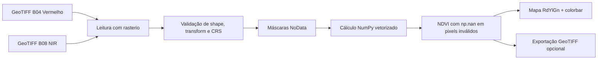

<div align="center">

# 🐝 BeeSpace — NDVI com Sentinel-2 L2A

### Mapeamento de Flora e Área de Forrageamento no JupyterLab do Copernicus


</div>

---

## 🌿 Visão Geral

Esta sessão do **BeeSpace** calcula o **NDVI** (*Normalized Difference Vegetation Index*) a partir de imagens **Sentinel-2 L2A** para apoiar o monitoramento de áreas de forrageamento de abelhas e a análise de vigor da vegetação.

O script principal está em:

```text
JupyterLab/Mapeamento de Flora e Cálculo de NDVI (Sentinel-2)
```

Ele foi pensado para uso direto no **JupyterLab do Copernicus**, usando apenas bibliotecas comuns em workflows geoespaciais Python:

- `rasterio` para leitura e escrita de rasters GeoTIFF;
- `numpy` para cálculo matricial vetorizado;
- `matplotlib` para visualização do mapa NDVI.

---

## 🛰️ Bandas Utilizadas

| Banda Sentinel-2 | Nome | Uso no NDVI | Interpretação |
|---|---|---|---|
| **B04** | Vermelho | Absorção pela clorofila | Vegetação saudável absorve bastante vermelho |
| **B08** | NIR | Infravermelho próximo | Vegetação saudável reflete bastante NIR |

<div align="center">

### Fórmula do NDVI

```text
NDVI = (NIR - Vermelho) / (NIR + Vermelho)
```

</div>

---

## 🎨 Interpretação Visual

O mapa é plotado com o colormap **`RdYlGn`**:

| Cor | Faixa aproximada | Interpretação ecológica |
|---|---:|---|
| 🔴 Vermelho | -1.0 a 0.0 | Água, sombra, nuvem, solo muito exposto ou ausência de vegetação |
| 🟡 Amarelo | 0.0 a 0.4 | Vegetação rala, solo misto ou áreas em transição |
| 🟢 Verde | 0.4 a 1.0 | Vegetação mais densa e vigorosa, potencialmente interessante para forrageamento |

> **Observação:** o NDVI indica vigor vegetativo, mas não substitui validação em campo. Para a BeeSpace, ele deve ser combinado com dados IoT das colmeias, floração observada, clima e contexto local.

---

## 📁 Estrutura Recomendada de Arquivos

Para facilitar a execução no notebook, organize os arquivos assim:

```text
BeeSpace/
└── JupyterLab/
    ├── Mapeamento de Flora e Cálculo de NDVI (Sentinel-2)
    ├── redme.md
    ├── dados/
    │   ├── Sentinel2_L2A_B04.tif
    │   └── Sentinel2_L2A_B08.tif
    └── resultados/
        └── ndvi_area_forrageamento_beespace.tif
```

---

## 🚀 Como Executar

### 1. Abra o script no JupyterLab

Abra o arquivo abaixo como uma célula ou copie seu conteúdo para um notebook:

```text
JupyterLab/Mapeamento de Flora e Cálculo de NDVI (Sentinel-2)
```

### 2. Ajuste os caminhos das bandas

No início do script, altere os caminhos conforme os seus arquivos locais:

```python
CAMINHO_BANDA_4_VERMELHO = Path("./dados/Sentinel2_L2A_B04.tif")
CAMINHO_BANDA_8_NIR = Path("./dados/Sentinel2_L2A_B08.tif")
```

### 3. Calcule e visualize o NDVI

Descomente o bloco final do script:

```python
ndvi_forrageamento, perfil_ndvi, extensao_ndvi = calcular_ndvi(
    CAMINHO_BANDA_4_VERMELHO,
    CAMINHO_BANDA_8_NIR,
)

plotar_ndvi(ndvi_forrageamento, extensao=extensao_ndvi)
```

### 4. Opcional: exporte para GeoTIFF

```python
salvar_ndvi_geotiff(
    ndvi_forrageamento,
    perfil_ndvi,
    "./resultados/ndvi_area_forrageamento_beespace.tif",
)
```

---

## 🧠 O que o Script Faz



### Validações incluídas

- Confere se B04 e B08 têm o mesmo tamanho de matriz;
- Confere se as bandas têm a mesma transformação espacial;
- Confere se as bandas estão no mesmo CRS;
- Ignora pixels `NoData`;
- Evita divisão por zero;
- Mantém pixels inválidos como `np.nan`;
- Usa escala visual fixa entre `-1` e `1`.

---

## ✅ Requisitos

Instale ou confirme as bibliotecas abaixo no ambiente do JupyterLab:

```bash
pip install rasterio numpy matplotlib
```

> No ambiente Copernicus/JupyterLab, parte dessas bibliotecas pode já estar disponível. Caso falte alguma, instale no kernel correto do notebook.

---

## 🐝 Uso no Contexto BeeSpace

O NDVI pode ajudar a responder perguntas como:

- Quais áreas próximas às colmeias têm maior vigor vegetativo?
- A área de forrageamento mudou após seca, chuva ou manejo agrícola?
- Existem manchas verdes persistentes que podem indicar recursos florais relevantes?
- O comportamento das colmeias acompanha mudanças espaciais ou temporais na vegetação?

<div align="center">

### 🌻 Da imagem de satélite ao manejo inteligente de colmeias

**Sentinel-2 → NDVI → Mapa de vigor → Decisão BeeSpace**

</div>

---

## 🔎 Boas Práticas

- Use bandas da **mesma cena** Sentinel-2 e da **mesma resolução espacial**.
- Prefira imagens com baixa cobertura de nuvens.
- Recorte a área de interesse antes do processamento se os arquivos forem muito grandes.
- Combine NDVI com dados de campo e sensores das colmeias.
- Para análise temporal, repita o processo em várias datas e compare os mapas.

---

## 📌 Resultado Esperado

Ao executar o fluxo, você deve obter:

1. Uma matriz `ndvi_forrageamento` com valores entre `-1` e `1`;
2. Um mapa colorido em **vermelho-amarelo-verde** com barra de cores;
3. Opcionalmente, um arquivo GeoTIFF georreferenciado com o NDVI calculado.

---

<div align="center">

## 🐝 BeeSpace

**Rede de colmeias inteligentes para monitoramento da biodiversidade**

🌎 Sensoriamento remoto • 🍯 Apicultura inteligente • 🌿 Biodiversidade • 📡 IoT

</div>
