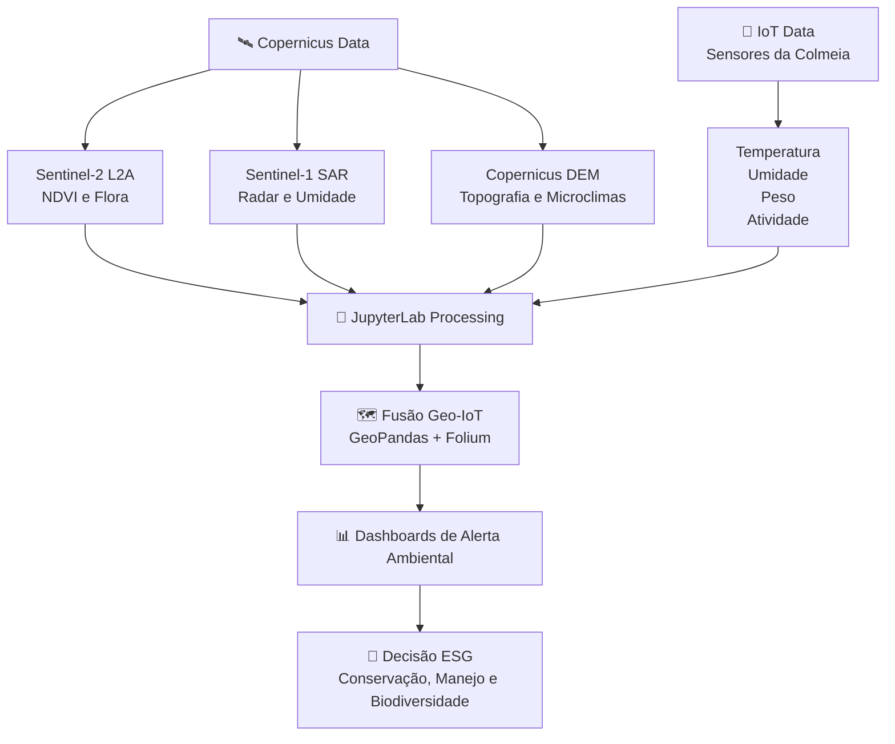

<div align="center">

# 🪐 BeeSpace - Hub de Ciências de Dados Espaciais

**O cérebro analítico da BeeSpace para transformar sinais de colmeias inteligentes e dados orbitais em inteligência ecológica acionável.**


</div>

---

## 🌎 Visão Geral

A pasta `JupyterLab/` centraliza os experimentos de ciência de dados espaciais da **BeeSpace**, conectando observação da Terra, topografia, radar orbital e telemetria de colmeias inteligentes. Esses notebooks e scripts funcionam como uma camada de validação científica para apoiar decisões em conservação, ESG, agricultura regenerativa e monitoramento de biodiversidade na Serra Gaúcha e em outros biomas.

> **Tecnologia climática de impacto nasce quando sensores locais conversam com satélites globais.**

Na arquitetura do projeto, este hub transforma dados brutos em indicadores ambientais interpretáveis: vigor vegetal, umidade/estrutura de superfície, influência do relevo em microclimas e correlação entre comportamento das abelhas e paisagem ao redor.

---

## 🧭 Arquitetura Analítica



---

## 🧩 Índice de Módulos

| Módulo | Tecnologia Principal | Aplicação na BeeSpace |
|---|---|---|
| 🌿 **Mapeamento de Flora e NDVI** | Sentinel-2 L2A, bandas espectrais, NDVI | Mede vigor vegetativo, identifica áreas de alimentação para polinizadores e apoia a leitura ecológica do entorno das colmeias. |
| 📡 **Automação de Radares SAR** | Sentinel-1, STAC, radar SAR | Automatiza a busca e análise de dados de radar para observar padrões de superfície mesmo com nuvens, chuva ou baixa luminosidade. |
| ⛰️ **Análise Topográfica de Microclimas** | Copernicus DEM, elevação, declividade | Explica como relevo, altitude e exposição influenciam microclimas, disponibilidade floral e estresse ambiental das colmeias. |
| 🐝 **Fusão Macro e Micro** | IoT, GeoPandas, Folium | Cruza telemetria de sensores da colmeia com camadas geoespaciais para gerar mapas interativos e alertas ambientais contextualizados. |

---

## 🗂️ Estrutura de Diretórios

```text
JupyterLab/
├── README.md
├── NDVI.Sentinel-2/
│   ├── REDME.md
│   └── NDVI.Sentinel-2.py
├── Automação.Temporais(Sentinel-1.SAR)/
│   ├── README.md
│   └── sentinel1_stac_metadata.py
├── Análise-Topográfica-Microclimas(DEM)/
│   ├── REDME.md
│   └── DEM.py
└── Fusão.Macro.Micro/
    ├── REDME.md
    └── beespace_geo_iot.py
```

> **Cada submódulo responde uma pergunta ambiental diferente; juntos, eles constroem uma visão sistêmica do território.**

---

## ⚡ Configuração Global - Quick Start

### 1. Criar e ativar ambiente virtual

```bash
cd BeeSpace
python -m venv .venv
source .venv/bin/activate  # Linux/macOS
# .venv\Scripts\activate   # Windows
```

### 2. Atualizar ferramentas de instalação

```bash
python -m pip install --upgrade pip setuptools wheel
```

### 3. Instalar pacotes essenciais

```bash
pip install jupyterlab numpy pandas geopandas shapely rasterio folium matplotlib pystac-client requests
```

### 4. Abrir o ambiente analítico

```bash
jupyter lab JupyterLab/
```

> Para análises orbitais em escala, recomenda-se configurar credenciais e rotas de acesso para catálogos STAC, Copernicus Browser, Sentinel Hub ou provedores equivalentes.

---

## 🧠 Como os Módulos se Complementam

- **NDVI + Flora** revela a saúde e a disponibilidade de vegetação no entorno da colmeia.
- **SAR + Radar** adiciona resiliência operacional, permitindo análise mesmo quando imagens ópticas são bloqueadas por nuvens.
- **DEM + Microclimas** contextualiza altitude, declividade e relevo como fatores de risco ou proteção ecológica.
- **Geo-IoT** conecta os sinais biológicos das abelhas ao território, transformando sensores em indicadores ambientais georreferenciados.

Essa integração permite que a BeeSpace vá além do monitoramento isolado de colmeias: o projeto se torna uma plataforma de leitura territorial para biodiversidade, clima e saúde dos ecossistemas.

---

## 🏆 Valor para Hackathons, ESG e Conservação

A proposta da BeeSpace combina **hardware maker**, **ciência cidadã**, **dados geoespaciais** e **analytics ambiental** em um pipeline demonstrável. Para avaliadores técnicos, este diretório evidencia que o projeto possui:

- 🔬 **Rigor científico** com uso de dados Sentinel, DEM e análise geoespacial.
- 🛠️ **Prototipagem aplicável** via sensores IoT e notebooks reproduzíveis.
- 🌱 **Impacto ESG mensurável** ao conectar biodiversidade, polinização e indicadores territoriais.
- 🚨 **Potencial de alerta precoce** para mudanças ambientais que afetam abelhas e ecossistemas.
- 🗺️ **Escalabilidade territorial** para Serra Gaúcha, Mata Atlântica, Pampa e outros biomas.

> **A BeeSpace transforma colmeias em sentinelas ambientais: pequenas estações biológicas capazes de narrar a saúde de um território inteiro.**

---

<div align="center">

### 🐝 BeeSpace: inteligência espacial para proteger polinizadores, biodiversidade e futuros regenerativos.

</div>
