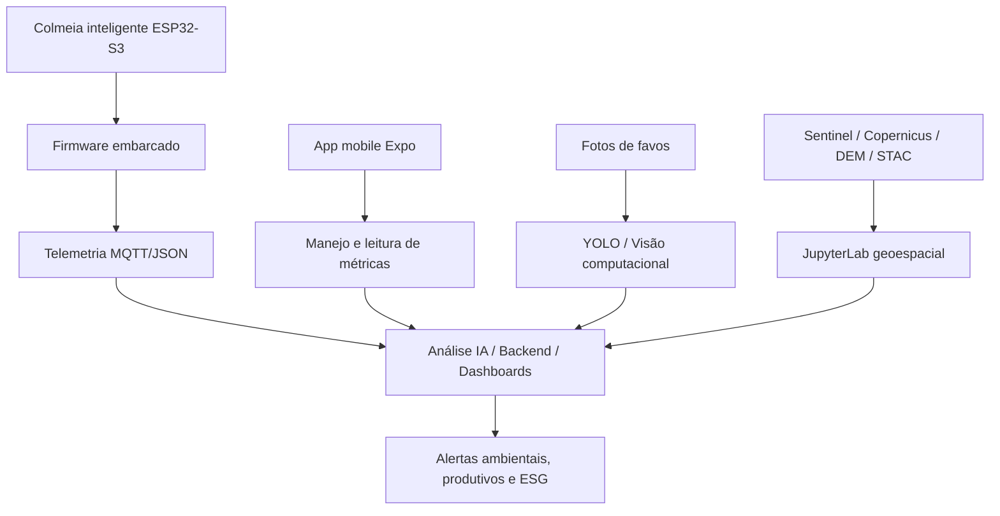
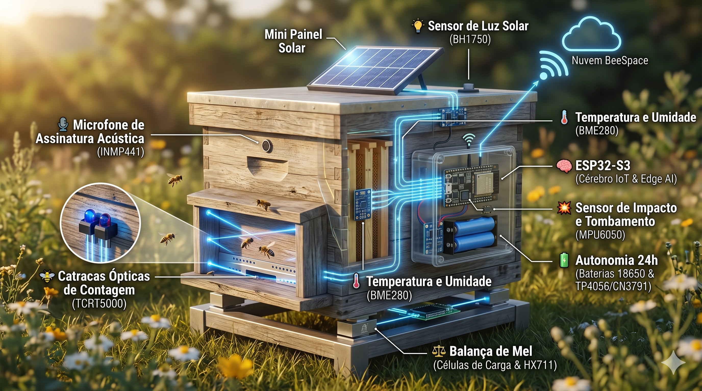

<div align="center">

# 🐝 BeeSpace: Biodiversidade em Órbita 🛰️

**Colmeias inteligentes para monitorar biodiversidade, clima, produção apícola e sinais ambientais, conectando sensores de campo, visão computacional, ciência de dados geoespaciais e dados Copernicus.**

**IoT · Machine Learning · Visão Computacional · Copernicus · ESG com dados verificáveis**

</div>

---

## Bem-vindo à colmeia

A **BeeSpace** transforma colmeias tradicionais em **biossensores inteligentes**. O projeto combina hardware embarcado, telemetria contínua, modelos de Machine Learning, visão computacional e dados orbitais para apoiar apicultores, pesquisadores, empresas e iniciativas de conservação.

A proposta central é cruzar:

- **Microdados da colmeia:** temperatura, umidade, peso, luminosidade, movimento, fluxo de abelhas, acústica e imagens de favos.
- **Macrodados ambientais:** vegetação, relevo, clima, cobertura do solo, radar orbital e indicadores atmosféricos obtidos a partir de fontes como Copernicus, Sentinel e catálogos STAC.

---

## Sumário

- [Sobre o projeto](#sobre-o-projeto)
- [Por que abelhas?](#por-que-abelhas)
- [Arquitetura do sistema](#arquitetura-do-sistema)
- [Estrutura atual do repositório](#estrutura-atual-do-repositório)
- [Módulos presentes](#módulos-presentes)
- [Como executar cada parte](#como-executar-cada-parte)
- [Hardware e firmware](#hardware-e-firmware)
- [Ciência de dados geoespaciais](#ciência-de-dados-geoespaciais)
- [Visão computacional](#visão-computacional)
- [Aplicativo mobile](#aplicativo-mobile)
- [Roadmap](#roadmap)
- [Como contribuir](#como-contribuir)
- [Licença](#licença)

---

## Sobre o projeto

A BeeSpace nasceu de uma necessidade real do campo: monitorar colmeias de forma contínua, confiável, acessível e auditável. Para isso, o repositório reúne protótipos e experimentos em cinco frentes:

| Frente | Papel no projeto |
|---|---|
| **Firmware ESP32-S3** | Coleta telemetria local, executa lógica embarcada e publica payloads MQTT/JSON. |
| **IA e ML tabular** | Classifica risco ambiental, produtivo e sanitário a partir de dados sintéticos e telemetria. |
| **Visão computacional** | Analisa fotos de favos com YOLO para medir composição visual: mel, néctar, pólen, ovos, larvas e crias. |
| **JupyterLab geoespacial** | Processa dados Sentinel, DEM, SAR e fusão Geo-IoT para leitura territorial. |
| **Aplicativo mobile** | Demonstra a experiência de manejo, métricas, alertas e visualização de dados da colmeia. |

---

## Por que abelhas?

Abelhas são bioindicadores importantes porque dependem diretamente da qualidade do ambiente no entorno da colmeia. Uma colmeia saudável reflete disponibilidade de água, flora, baixa pressão química, microclima adequado, alimento e estabilidade ecológica.

O monitoramento de colmeias permite observar sinais de alerta precoce relacionados a:

- estresse térmico e hídrico;
- perda de vegetação e redução de pasto apícola;
- poluição atmosférica ou pressão química;
- anomalias acústicas e comportamentais;
- mortalidade observada;
- alterações de peso e produtividade;
- riscos de furto, impacto ou tombamento.

---

## Arquitetura do sistema



Fluxo conceitual:

1. A colmeia coleta sinais físicos, acústicos e ambientais.
2. O firmware no ESP32-S3 organiza leituras de sensores e eventos.
3. A telemetria é preparada para publicação em MQTT/JSON.
4. Scripts Python e notebooks analisam risco, anomalias e contexto territorial.
5. O app mobile apresenta uma experiência de manejo e acompanhamento.
6. A visão computacional transforma imagens de favos em indicadores objetivos.

---

## Estrutura atual do repositório

A árvore abaixo reflete os diretórios e arquivos presentes no repositório, ignorando `.git/` e `node_modules/`.

```text
BeeSpace/
├── README.md
├── hardware.png
├── MVP-BeeSpace/
│   ├── LICENSE
│   ├── README.md
│   ├── beespace_mvp.py
│   ├── dados_sinteticos_beespace.xlsx
│   ├── gitignore
│   ├── modelo_beespace_mvp.pkl
│   └── requirements.docx
├── JupyterLab/
│   ├── README.md
│   ├── Análise-Topográfica-Microclimas(DEM)/
│   │   ├── DEM.py
│   │   └── REDME.md
│   ├── Automação.Temporais(Sentinel-1.SAR)/
│   │   ├── README.md
│   │   └── sentinel1_stac_metadata.py
│   ├── Fusão.Macro.Micro/
│   │   ├── REDME.md
│   │   └── beespace_geo_iot.py
│   └── NDVI.Sentinel-2/
│       ├── NDVI.Sentinel-2.py
│       └── REDME.md
├── apps/
│   ├── mobile/
│   │   ├── .gitignore
│   │   ├── App.tsx
│   │   ├── README.md
│   │   ├── app.json
│   │   ├── babel.config.js
│   │   ├── package.json
│   │   ├── tsconfig.json
│   │   └── src/
│   │       ├── components/
│   │       │   ├── MetricTile.tsx
│   │       │   ├── ProgressBar.tsx
│   │       │   └── SectionCard.tsx
│   │       ├── data/
│   │       │   └── mockHive.ts
│   │       ├── services/
│   │       │   └── api.ts
│   │       ├── theme.ts
│   │       ├── types/
│   │       │   └── beespace.ts
│   │       └── utils/
│   │           └── status.ts
│   └── web/
│       └── .gitkeep
├── firmware/
│   └── esp32-s3/
│       ├── IA.py
│       ├── README.md
│       ├── main.cpp
│       └── platformio.ini
└── visao.computacional/
    ├── COD.py
    └── README.md
```

---

## Módulos presentes

| Caminho | Conteúdo | Status |
|---|---|---|
| `MVP-BeeSpace/` | MVP em Python com Random Forest, dados sintéticos em Excel, modelo `.pkl`, documentação e licença própria. | Prova de conceito de ML tabular. |
| `firmware/esp32-s3/` | Projeto PlatformIO/Arduino para ESP32-S3, firmware principal e script Python de detecção de anomalias por Isolation Forest. | Protótipo embarcado e IA operacional externa ao microcontrolador. |
| `visao.computacional/` | Pipeline Python para carregar YOLO, inferir classes em imagens de favos e gerar composição quantitativa. | Módulo de inferência para manejo visual. |
| `JupyterLab/` | Hub de scripts e documentação para NDVI Sentinel-2, Sentinel-1 SAR, DEM e fusão Geo-IoT. | Experimentos de ciência de dados espaciais. |
| `apps/mobile/` | Aplicativo React Native/Expo com tela demonstrativa, dados mockados, componentes, tipos e utilitários. | Protótipo mobile. |
| `apps/web/` | Diretório reservado com `.gitkeep`. | Placeholder para futura aplicação web. |
| `hardware.png` | Ilustração da arquitetura física da colmeia inteligente. | Ativo visual de documentação. |

---

## Como executar cada parte

### MVP de Machine Learning tabular

```bash
cd MVP-BeeSpace
python beespace_mvp.py
```

O script gera dados sintéticos, treina um classificador, avalia o desempenho, calcula importância de variáveis, simula uma nova colmeia e salva artefatos como dataset e modelo.

> Observação: o diretório possui `requirements.docx`, mas não possui `requirements.txt`. Instale manualmente as dependências Python usadas no script, como `numpy`, `pandas`, `scikit-learn`, `joblib` e bibliotecas de planilha necessárias ao seu ambiente.

### Firmware ESP32-S3

```bash
cd firmware/esp32-s3
pio run
```

Para gravar em uma placa conectada:

```bash
pio run --target upload
```

Para abrir o monitor serial:

```bash
pio device monitor
```

O projeto usa PlatformIO com framework Arduino para `esp32-s3-devkitc-1`.

### IA de anomalias da telemetria

```bash
python firmware/esp32-s3/IA.py
```

Esse script roda em computador, gateway, servidor ou backend. Ele não é firmware do ESP32-S3; ele treina e exporta um modelo `modelo_beespace_isolation_forest.pkl` para analisar telemetria da colmeia.

### Visão computacional

```bash
python visao.computacional/COD.py --model best.pt --image exemplos/favo.jpg --output-dir saidas
```

O comando espera um peso YOLO treinado, por exemplo `best.pt`, e uma imagem de favo. O módulo foi estruturado para contar classes e gerar indicadores percentuais.

### JupyterLab geoespacial

```bash
python -m venv .venv
source .venv/bin/activate
python -m pip install --upgrade pip setuptools wheel
python -m pip install jupyterlab numpy pandas geopandas shapely rasterio folium matplotlib pystac-client requests
jupyter lab JupyterLab/
```

.
.git
.git/branches
.git/hooks
.git/info
.git/logs
.git/objects
.git/refs
JupyterLab
JupyterLab/Análise-Topográfica-Microclimas(DEM)
JupyterLab/Automação.Temporais(Sentinel-1.SAR)
JupyterLab/Fusão.Macro.Micro
JupyterLab/NDVI.Sentinel-2
MVP-BeeSpace
apps
apps/mobile
apps/web
firmware
firmware/esp32-s3
visao.computacional
Módulos disponíveis:

- `JupyterLab/NDVI.Sentinel-2/` — cálculo e visualização de NDVI.
- `JupyterLab/Automação.Temporais(Sentinel-1.SAR)/` — consulta de metadados Sentinel-1 em catálogo STAC.
- `JupyterLab/Análise-Topográfica-Microclimas(DEM)/` — análise de elevação, declividade e microclimas.
- `JupyterLab/Fusão.Macro.Micro/` — fusão entre telemetria IoT e camadas geoespaciais.

### Aplicativo mobile

```bash
cd apps/mobile
npm install
npm run start
```

Comandos adicionais:

```bash
npm run android
npm run ios
npm run web
npm run typecheck
```

O app usa Expo, React Native e TypeScript. A versão atual trabalha com dados mockados e componentes reutilizáveis para métricas e status da colmeia.

---

## Hardware e firmware



<details>
  <summary><strong>Descrição da imagem</strong></summary>

Ilustração de uma colmeia instrumentada com painel solar, ESP32-S3, sensores de temperatura e umidade, microfone, catracas ópticas, célula de carga, acelerômetro e comunicação sem fio com a nuvem BeeSpace.

</details>

Componentes representados na proposta:

- **ESP32-S3** como unidade de processamento embarcado.
- **BME280** para temperatura, umidade e pressão.
- **INMP441** para assinatura acústica via I2S.
- **TCRT5000** para contagem de entrada e saída de abelhas.
- **HX711 + células de carga** para peso da colmeia.
- **MPU6050** para impacto, vibração e possível furto.
- **BH1750** para luminosidade.
- **Bateria 18650, carregamento e painel solar** para autonomia.

---

## Ciência de dados geoespaciais

A camada `JupyterLab/` complementa a telemetria local com observação da Terra:

- **Sentinel-2 / NDVI:** vigor da vegetação e disponibilidade de pasto apícola.
- **Sentinel-1 SAR:** leitura por radar em cenários com nuvens, fumaça ou baixa luminosidade.
- **Copernicus DEM:** relevo, altitude, declividade e influência topográfica em microclimas.
- **Fusão Geo-IoT:** integração de sinais da colmeia com camadas espaciais e mapas interativos.

Essa camada ajuda a responder se uma alteração observada na colmeia é local, ambiental, climática ou territorial.

---

## Visão computacional

O módulo `visao.computacional/` organiza o pipeline para análise de imagens de favos com YOLO. As classes esperadas no domínio BeeSpace são:

- `mel`
- `nectar`
- `polen`
- `ovos`
- `larvas`
- `crias_operculadas`

A meta é reduzir subjetividade no manejo, transformando inspeções visuais em contagens, percentuais, relatórios e imagens anotadas.

---

## Aplicativo mobile

O app em `apps/mobile/` é um protótipo Expo/React Native para apresentar a BeeSpace ao usuário de campo. Ele reúne:

- tela principal em `App.tsx`;
- componentes de cartão, métricas e barras de progresso;
- tema visual centralizado;
- dados mockados de colmeia;
- tipos TypeScript do domínio;
- serviço de API preparado para futura integração.

---

## Roadmap

Próximas evoluções sugeridas, considerando a estrutura atual do repositório:

- Padronizar nomes `REDME.md` para `README.md` nos submódulos em que isso ainda aparece.
- Criar `requirements.txt` ou `pyproject.toml` para os módulos Python.
- Definir contratos MQTT/JSON versionados.
- Separar credenciais do firmware em provisionamento seguro ou NVS.
- Adicionar testes automatizados para Python e TypeScript.
- Documentar esquemáticos eletrônicos e lista de materiais em um diretório dedicado.
- Evoluir `apps/web/` de placeholder para dashboard web.
- Integrar o app mobile a uma API real de telemetria.

---

## Como contribuir

Contribuições são bem-vindas para fortalecer a colmeia:

1. Faça um fork do repositório.
2. Crie uma branch com nome descritivo.
3. Documente alterações de hardware, firmware, dados, modelos ou interface.
4. Inclua exemplos mínimos reproduzíveis quando possível.
5. Abra um Pull Request explicando impacto, testes e limitações.

Áreas prioritárias:

- firmware ESP32-S3;
- modelos YOLO;
- integração Copernicus/STAC;
- dashboards e app mobile;
- validação científica e documentação.

---

## Licença

O diretório `MVP-BeeSpace/` possui arquivo `LICENSE`. Para o restante do repositório, a licença geral ainda deve ser formalizada. Até a publicação de uma licença raiz, trate o conteúdo fora de `MVP-BeeSpace/` como material do projeto BeeSpace com direitos reservados.

---

<div align="center">

**BeeSpace — biodiversidade monitorada por colmeias, dados e órbita.**

🐝 + 🛰️ + 💻 + 🌱

</div>
