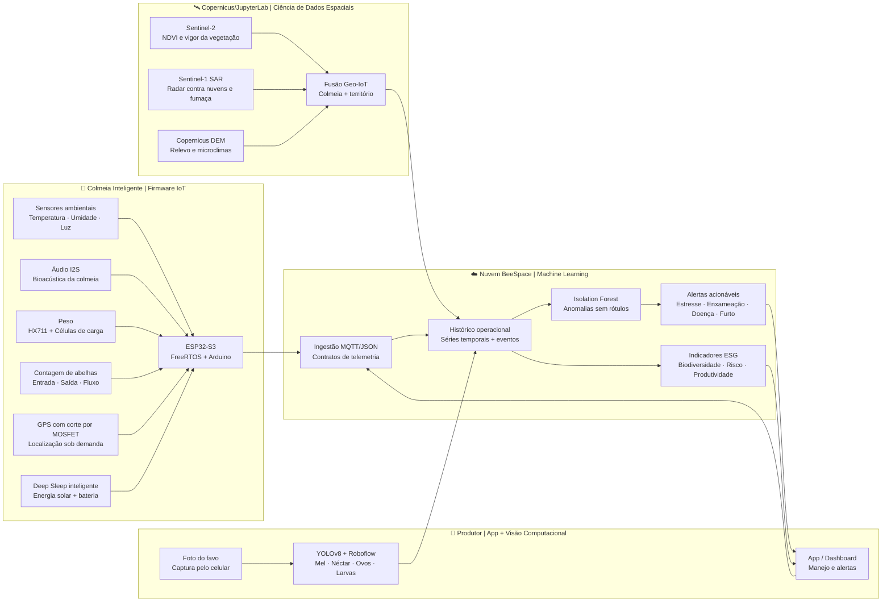

<div align="center">

# 🐝 BeeSpace

## **Biodiversidade em Órbita 🛰️**

**Apicultura inteligente 360º para transformar colmeias em biossensores ESG, combinando IoT embarcado, satélites Copernicus, Visão Computacional e Machine Learning para proteger abelhas, produção agrícola e biodiversidade.**

<br />


<br />

### **Colmeias conectadas · Satélites Copernicus · IA aplicada · Conservação ambiental · Dados acionáveis para o produtor**

</div>

---

## ✨ Visão em uma frase

A **BeeSpace** conecta o que acontece **dentro da colmeia** com o que muda **ao redor dela no território**, criando uma camada de inteligência para apicultores, pesquisadores, empresas e iniciativas de conservação que precisam decidir rápido, com evidência e impacto mensurável.

---

## 🌎 O Problema & O Impacto

A apicultura está no centro de uma equação crítica: **abelhas sustentam polinização, polinização sustenta produtividade agrícola, e produtividade agrícola sustenta segurança alimentar**. Ainda assim, muitos produtores operam com pouca instrumentação, inspeções manuais espaçadas e quase nenhum contexto ambiental externo.

> **Quando a colmeia dá sinais visíveis de colapso, a janela ideal de intervenção pode já ter passado.**

> **Sem dados confiáveis, o produtor não sabe se a queda de produção vem de manejo, clima, doença, perda de florada, intoxicação ou pressão ambiental no entorno.**

A BeeSpace propõe uma resposta prática: transformar colmeias em **estações vivas de monitoramento de biodiversidade**, cruzando telemetria local, imagens de favos, séries temporais e dados orbitais para gerar alertas, indicadores e evidências ESG.

---

## 🛰️ Arquitetura 360º



---

## 🧭 Módulos do Sistema

| Ícone | Nome do módulo | Stack principal | Acesso |
|---:|---|---|---|
| 🔌 | **Firmware IoT** | ESP32-S3, FreeRTOS, Arduino, PlatformIO, I2S, GPS, HX711, sensores ambientais, MOSFET, MQTT/JSON | [Acessar Módulo](./firmware/esp32-s3) |
| 🛰️ | **Ciência de Dados Espaciais** | Python, JupyterLab, Copernicus, Sentinel-2 NDVI, Sentinel-1 SAR, DEM, STAC, Rasterio, GeoPandas | [Acessar Módulo](./JupyterLab) |
| 👁️ | **Visão Computacional** | YOLOv8, Roboflow, Python, inferência por imagem, classificação de alvéolos e composição do favo | [Acessar Módulo](./visao.computacional) |
| 🧠 | **Inteligência Artificial / ML** | Python, scikit-learn, Isolation Forest, telemetria, séries temporais, anomalias e alertas | [Acessar Módulo](./firmware/esp32-s3/IA.py) |

---

## 🚀 Diferenciais Técnicos que importam no campo

- **Autonomia energética realista:** estratégia de **Deep Sleep**, leituras em ciclos e desligamento do GPS por **MOSFET** para reduzir consumo fora do momento de coleta.
- **Bioacústica aplicada à apicultura:** áudio via **I2S** abre caminho para detectar padrões de estresse, enxameação e comportamento coletivo.
- **Radar para atravessar nuvens:** **Sentinel-1 SAR** permite leitura territorial mesmo em cenários com nuvens, fumaça, chuva leve ou baixa luminosidade.
- **NDVI para pasto apícola:** **Sentinel-2** ajuda a estimar vigor vegetal, oferta de florada e mudanças ambientais no raio de atuação das abelhas.
- **Microclima por topografia:** **DEM** adiciona altitude, declividade e exposição ao relevo, variáveis que influenciam conforto térmico e produtividade.
- **Machine Learning sem depender de rótulos caros:** **Isolation Forest** detecta desvios multivariados em telemetria mesmo quando não há histórico rotulado de doença, enxameação ou estresse.
- **Visão computacional para reduzir subjetividade:** fotos de celular do favo viram métricas sobre mel, néctar, ovos, larvas e crias.
- **Narrativa ESG auditável:** a união de IoT + satélites + IA cria evidências rastreáveis para biodiversidade, produtividade e risco ambiental.

---

## ⚡ Quickstart / Como Reproduzir

> **Trilha recomendada para avaliadores:** comece pelo firmware e pela IA de anomalias; depois explore visão computacional e geoespacial para entender a proposta 360º.

### 1. Clonar o repositório

```bash
git clone https://github.com/<seu-usuario>/BeeSpace.git
cd BeeSpace
```

### 2. Entender a proposta visual de hardware

```bash
xdg-open hardware.png
```

> Em ambientes sem interface gráfica, abra `hardware.png` diretamente pelo GitHub.

### 3. Compilar o firmware ESP32-S3

```bash
cd firmware/esp32-s3
pio run
```

Para gravar e acompanhar a placa:

```bash
pio run --target upload
pio device monitor
```

### 4. Executar a IA de anomalias

```bash
cd ../../
python firmware/esp32-s3/IA.py
```

### 5. Rodar a visão computacional com YOLOv8

```bash
python visao.computacional/COD.py --model best.pt --image exemplos/favo.jpg --output-dir saidas
```

> Substitua `best.pt` pelo peso treinado no Roboflow e `exemplos/favo.jpg` por uma imagem de favo disponível no seu ambiente.

### 6. Abrir o laboratório geoespacial

```bash
python -m venv .venv
source .venv/bin/activate
python -m pip install --upgrade pip
python -m pip install jupyterlab numpy pandas geopandas shapely rasterio folium matplotlib pystac-client requests
jupyter lab JupyterLab/
```

---

## 🧪 O que a BeeSpace mede

| Camada | Sinais observados | Decisão habilitada |
|---|---|---|
| **Colmeia** | Temperatura, umidade, luminosidade, peso, vibração, áudio, fluxo de abelhas e GPS | Manejo, segurança, produtividade e saúde da colônia |
| **Favo** | Mel, néctar, pólen, ovos, larvas e crias operculadas | Qualidade da rainha, força da colônia e momento de colheita |
| **Território** | NDVI, radar SAR, relevo, declividade, vegetação e contexto espacial | Risco ambiental, disponibilidade de pasto apícola e microclimas |
| **IA** | Anomalias em séries temporais e combinações multivariadas | Alertas antecipados de estresse, enxameação, doença, furto ou falha operacional |

---

## 🧑‍⚖️ Roteiro rápido

| Perfil de avaliação | Comece por | O que observar |
|---|---|---|
| **Negócios e impacto** | Este README + `hardware.png` | Dor real, tese ESG, aplicabilidade no agro e narrativa 360º |
| **Engenharia embarcada** | `firmware/esp32-s3/` | Sensores, autonomia, telemetria, FreeRTOS e PlatformIO |
| **Dados e IA** | `firmware/esp32-s3/IA.py` e `MVP-BeeSpace/` | Anomalias, modelos tabulares e geração de alertas |
| **Geoespacial** | `JupyterLab/` | NDVI, Sentinel-1 SAR, DEM e fusão Geo-IoT |
| **Produto e manejo** | `visao.computacional/` | Inferência YOLOv8 e transformação de imagem em indicador |

---

## 🛠️ Estrutura do Repositório

```text
BeeSpace/
├── firmware/esp32-s3/          # Firmware ESP32-S3 + IA de anomalias
├── JupyterLab/                 # NDVI, SAR, DEM e fusão Geo-IoT
├── visao.computacional/        # Inferência YOLOv8 para fotos de favos
├── MVP-BeeSpace/               # MVP tabular em Python com artefatos de modelo
├── apps/mobile/                # Protótipo mobile Expo/React Native
├── apps/web/                   # Base reservada para dashboard web
├── hardware.png                # Visual do conceito físico da colmeia inteligente
└── README.md                   # Documentação principal
```

---

## 🧩 Roadmap de Alto Impacto

- [ ] Versionar contratos **MQTT/JSON** para telemetria da colmeia.
- [ ] Criar `requirements.txt` ou `pyproject.toml` por módulo Python.
- [ ] Adicionar datasets de exemplo anonimizados para demonstração reprodutível.
- [ ] Publicar imagens de exemplo anotadas pelo pipeline YOLOv8.
- [ ] Integrar dashboard web com alertas, mapas e indicadores ESG.
- [ ] Conectar telemetria real a banco de séries temporais e API.
- [ ] Documentar lista de materiais, esquemático, consumo energético e autonomia estimada.
- [ ] Validar sinais de bioacústica com dados reais de campo.

---

## 🏆 Por que a BeeSpace ?

| Vantagens | Como a BeeSpace responde |
|---|---|
| **Impacto real** | Ataca mortalidade de abelhas, baixa previsibilidade produtiva e falta de dados ambientais no campo. |
| **Diferenciação técnica** | Integra IoT, visão computacional, ML não-supervisionado e satélites Copernicus em uma arquitetura única. |
| **Viabilidade** | Usa ESP32-S3, Python, JupyterLab, YOLOv8 e ferramentas acessíveis para prototipagem rápida. |
| **Escalabilidade** | Cada colmeia pode virar um nó replicável de monitoramento de biodiversidade e produção. |
| **ESG mensurável** | Gera evidências sobre saúde da colmeia, contexto territorial, risco ambiental e produtividade. |

---

<div align="center">

## 🐝 Obrigado, avaliadores!

**A BeeSpace foi criada para provar que uma colmeia pode ser mais do que uma unidade produtiva: ela pode ser uma sentinela viva da biodiversidade.**

Se este projeto ajudou você a enxergar o campo com mais dados, ciência e impacto, a missão já começou.

<br />

**BeeSpace**

🐝 · 🛰️ · 🧠 · 🌱

</div>
