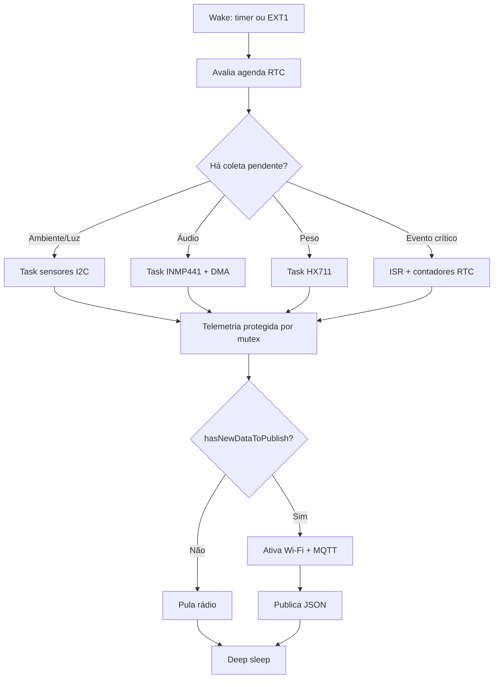

<div align="center">
🐝 BeeSpace Firmware — ESP32-S3
Firmware de produção para o biossensor inteligente de colmeias BeeSpace.<br>
Desenvolvido com PlatformIO + Arduino, usando FreeRTOS, MQTT/JSON e estratégia agressiva de deep sleep para operação em campo.


</div>

---

## ✨ Visão geral

Este firmware coordena sensores ambientais, acústicos, de movimento, peso e fluxo de abelhas em um ESP32-S3. A arquitetura prioriza baixo consumo: o dispositivo acorda por temporizador ou interrupção, coleta apenas os dados necessários, publica telemetria quando há informação nova e retorna ao modo de deep sleep.

### Principais recursos

- 🌡️ Coleta ambiental com **BME280** e luminosidade com **BH1750**.
- 🎙️ Captura acústica por **INMP441** via I2S/DMA.
- ⚖️ Monitoramento de peso com **HX711**.
- 🚪 Contagem de entrada/saída com sensores **TCRT5000**.
- 🛡️ Detecção de movimento/furto com **MPU6050**.
- 📡 Publicação sob demanda via **MQTT** em payloads JSON.
- 🔋 Ciclo de energia otimizado com **RTC memory**, **EXT1 wake** e deep sleep.

---

## 🧭 Pinout sugerido

| Periférico | Função | GPIO ESP32-S3 | Observações |
|---|---:|---:|---|
| I2C comum | SDA | GPIO 8 | Barramento para BME280, MPU6050 e BH1750. |
| I2C comum | SCL | GPIO 9 | Usar pull-ups de 4,7 kΩ para 3V3. |
| INMP441 | I2S SCK/BCLK | GPIO 12 | Evita GPIOs de strapping e USB nativo. |
| INMP441 | I2S WS/LRCLK | GPIO 13 | Configurado como RX mono 32 bits. |
| INMP441 | I2S SD/DOUT | GPIO 14 | Entrada I2S com DMA. |
| TCRT5000 entrada | Digital/RTC wake | GPIO 4 | Interrupção com debounce; pino RTC para EXT1 wake. |
| TCRT5000 saída | Digital/RTC wake | GPIO 5 | Interrupção com debounce; pino RTC para EXT1 wake. |
| HX711 | DOUT | GPIO 16 | Entrada digital da célula de carga. |
| HX711 | SCK | GPIO 17 | Clock do HX711. |
| MPU6050 | INT | GPIO 6 | Interrupção de movimento; acorda por EXT1. |
| BH1750 | ADDR | GND | Endereço padrão `0x23`. |
| Bateria | ADC | GPIO 1 | ADC1; divisor resistivo de alta impedância com capacitor de filtro. |
| Status opcional | LED | GPIO 21 | Pode ser removido em produção para menor consumo. |

> [!CAUTION]
> Evite usar GPIO 0, 3, 45 e 46 para periféricos críticos por serem pinos de strapping/boot ou entrada-only em placas ESP32-S3 comuns. Evite também GPIO 19/20 se a placa usa USB nativo.

---

## 📚 Bibliotecas e APIs

O firmware usa as seguintes bibliotecas e APIs:

| Categoria | Dependências |
|---|---|
| Comunicação | `WiFi.h`, `PubSubClient`, `ArduinoJson` |
| Sensores I2C | `Wire.h`, `Adafruit_BME280`, `Adafruit_MPU6050`, `BH1750` |
| Peso | `HX711` |
| Áudio | `driver/i2s.h` |
| Sistema | APIs ESP-IDF/Arduino para FreeRTOS, GPIO, ADC e deep sleep (`esp_sleep.h`, `freertos/*`) |

---

## 🚀 Compilação

Execute a build a partir da pasta do firmware:

```bash
cd firmware/esp32-s3
pio run
```

> [!IMPORTANT]
> As credenciais de Wi-Fi/MQTT estão simuladas via `#define` em `src/main.cpp`. Antes do uso em campo, substitua por segredo de build, arquivo de configuração protegido ou fluxo de provisioning.

---
## ⏱️ Agenda de aquisição

| Dado | Frequência configurada | Comportamento de energia/MQTT |
|---|---:|---|
| BME280 + BH1750 | A cada 120 minutos | Sensores ambientais só são energizados/lidos no tick agendado. |
| INMP441 | A cada 30 minutos | O microfone I2S captura por 5 minutos com DMA e publica métricas acústicas. |
| HX711 | A cada 7 dias | A balança é ligada, lida com fator/offset calibrados e colocada em `power_down()` após a leitura. |
| MQTT | Sob demanda | Wi-Fi/MQTT só conecta quando há dado novo, contagem de catraca ou alerta crítico. |

A agenda usa um tick RTC de 15 minutos preservado em `RTC_DATA_ATTR`. Wakes por EXT1 não avançam o relógio periódico, então eventos de catraca/furto não antecipam leituras de BME280/BH1750, áudio ou HX711.

---

## 🏗️ Arquitetura de execução



### Fluxo resumido

1. O ESP32-S3 acorda por temporizador ou por EXT1.
2. A agenda preservada em `RTC_DATA_ATTR` define quais sensores precisam operar.
3. Tasks FreeRTOS coletam dados e atualizam a telemetria compartilhada com mutex.
4. Event groups sinalizam conclusão de coleta.
5. A task MQTT ativa Wi-Fi apenas quando `hasNewDataToPublish()` detecta dados frescos, contadores de abelhas ou alerta de furto.
6. O dispositivo retorna ao deep sleep após publicar ou confirmar que não há dados novos.

---

## 💤 Estratégia de baixo consumo

Durante o deep sleep, a abordagem prática no Arduino é manter sensores críticos em pinos RTC e usar `esp_sleep_enable_ext1_wakeup()` para acordar com eventos da catraca TCRT5000 ou do pino `INT` do MPU6050.

Os contadores ficam em `RTC_DATA_ATTR`, preservados entre sleeps. O firmware semeia o primeiro evento a partir da máscara EXT1 e permanece uma pequena janela ativa contando pulsos por ISR com debounce.

> [!TIP]
> Para contagem contínua em sono profundo total, a evolução recomendada é mover os TCRT5000 para o coprocessador ULP RISC-V do ESP32-S3 ou para um contador externo ultrabaixo consumo alimentado permanentemente.

---

## ✅ Checklist antes de campo

- [ ] Calibrar fator e offset da célula de carga HX711.
- [ ] Validar divisores resistivos e leitura ADC da bateria.
- [ ] Trocar credenciais simuladas por secrets/provisioning.
- [ ] Confirmar pull-ups I2C de 4,7 kΩ para 3V3.
- [ ] Medir consumo real em deep sleep e durante transmissão MQTT.
- [ ] Testar acordar por EXT1 com TCRT5000 e MPU6050.

---
<div align="center">

**BeeSpace** — telemetria inteligente para colmeias conectadas.

</div>
