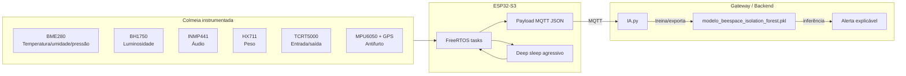
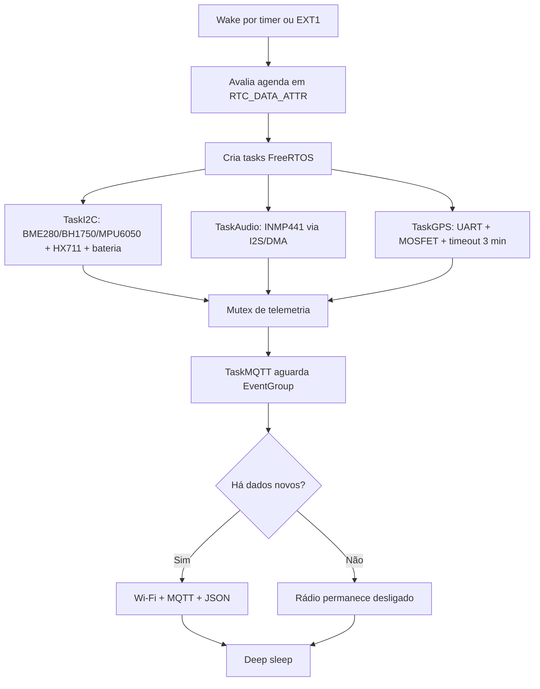

<div align="center">
🐝 # BeeSpace Firmware ESP32-S3


Firmware de produção para o biossensor inteligente de colmeias BeeSpace, com telemetria ambiental, acústica, peso, fluxo de abelhas, geolocalização antifurto e pipeline de IA para detecção de anomalias.

</div>

---
## 📌 Índice

- [Visão geral](#-visão-geral)
- [Arquitetura fim a fim](#-arquitetura-fim-a-fim)
- [Firmware ESP32-S3](#-firmware-esp32-s3)
- [IA.py — Detecção inteligente de anomalias](#-iapy--detecção-inteligente-de-anomalias)
- [Payload MQTT esperado](#-payload-mqtt-esperado)
- [Instalação e execução](#-instalação-e-execução)
- [Pinout sugerido](#-pinout-sugerido)
- [Checklist de campo](#-checklist-de-campo)

---

## ✨ Visão geral

O módulo BeeSpace combina um **nó IoT de baixíssimo consumo** com um **serviço de IA externo ao microcontrolador**:

| Camada | Responsabilidade | Tecnologia |
|---|---|---|
| 🟢 **Borda embarcada** | Coletar sensores, economizar bateria e publicar telemetria | ESP32-S3, PlatformIO, Arduino, FreeRTOS, MQTT/JSON |
| 🧠 **IA / Gateway / Backend** | Aprender o comportamento normal da colmeia e detectar desvios | Python, Pandas, NumPy, scikit-learn, Isolation Forest |
| 📡 **Operação apícola** | Receber alertas e apoiar decisão de inspeção | Broker MQTT, dashboard, servidor local ou cloud |

> **Importante:** o arquivo `IA.py` não roda no ESP32-S3. Ele deve executar em um gateway, servidor local, backend cloud ou notebook operacional que consome os payloads MQTT publicados pelo firmware.

---

## 🏗 Arquitetura fim a fim



### Fluxo embarcado

---

## 🔌 Firmware ESP32-S3

O firmware usa **PlatformIO**, **Arduino Framework**, **FreeRTOS**, **MQTT** e **ArduinoJson** para operar um nó IoT alimentado por bateria. O ESP32-S3 acorda por temporizador de 15 minutos ou por interrupção EXT1, coleta somente os dados necessários, liga o rádio Wi-Fi apenas quando existe telemetria nova e retorna ao deep sleep.

### Principais recursos

- ⚡ **Deep sleep agressivo** com agenda preservada em `RTC_DATA_ATTR`.
- 📶 **Wi-Fi sob demanda**, ativado somente quando há dados relevantes para publicar.
- 🐝 **Contagem de fluxo de abelhas** com TCRT5000 e wake EXT1.
- 🎙️ **Assinatura acústica** com INMP441 via I2S/DMA.
- ⚖️ **Monitoramento de peso** com HX711.
- 🧭 **Antifurto por MPU6050 + GPS NEO-6M** energizado por MOSFET.
- 📦 **Payload MQTT JSON modular**, com seções condicionais para economizar bytes.

### Estratégia de energia

A BeeSpace opera com um **tick RTC de 15 minutos**. Wakes por timer avançam a agenda periódica; wakes por EXT1 são tratados como eventos assíncronos e não antecipam leituras pesadas desnecessárias.

| Decisão | Benefício |
|---|---|
| Wi-Fi somente na publicação | Reduz consumo do rádio |
| Contadores em RTC RAM | Preserva eventos sem escrita em flash |
| EXT1 nos GPIOs 4, 5 e 6 | Acorda em fluxo de abelhas ou suspeita de furto |
| GPS com MOSFET no GPIO 7 | Corta VCC do NEO-6M no deep sleep |
| Fix GPS com timeout de 3 minutos | Evita drenar bateria em céu fechado |

---

## 🧠 `IA.py` — Detecção inteligente de anomalias

O arquivo `IA.py` adiciona ao projeto um pipeline de IA para aprender o comportamento normal de uma colmeia e gerar alertas explicáveis quando a telemetria foge do padrão.

### O que o script faz

1. 🧪 **Gera dataset sintético de 30 dias** com leituras ambientais, acústicas, peso e fluxo de abelhas.
2. 🧬 **Cria features de negócio**, como saldo de fluxo, variação de peso em 1 hora, variação térmica e índice acústico de estresse.
3. 🚨 **Injeta cenários anômalos para validação**, incluindo possível orfandade/estresse, enxameação e falha estrutural.
4. 🌲 **Treina um Isolation Forest** somente com janelas normais.
5. 💾 **Exporta o artefato** `modelo_beespace_isolation_forest.pkl` via `joblib`.
6. 🔎 **Analisa novos payloads MQTT/JSON** com `analisar_telemetria()`.
7. 📝 **Explica o alerta** listando os sensores/features que mais contribuíram para o desvio.

### Features usadas pelo modelo

| Grupo | Features |
|---|---|
| Ambiente | `temperature_c`, `humidity_percent`, `pressure_hpa`, `luminosity_lux` |
| Acústica | `audio_rms`, `audio_peak`, `audio_zero_crossing_rate` |
| Produção/biologia | `weight_kg`, `bee_entries_per_min`, `bee_exits_per_min` |
| Engenharia | `bee_flow_balance`, `weight_delta_1h`, `temperature_delta_1h`, `acoustic_stress_index` |

### Cenários de alerta simulados

| Cenário | Assinatura esperada |
|---|---|
| 👑 Possível orfandade ou estresse | Queda de temperatura interna, instabilidade acústica e redução do fluxo |
| 🐝 Possível enxameação | Queda súbita de peso, pico de saídas e saldo de fluxo negativo |
| 🌧️ Possível falha estrutural | Umidade alta, luminosidade anormal e queda térmica |

### Saída de alerta

Quando uma leitura é considerada anômala, `analisar_telemetria()` retorna um texto pronto para notificação:

```text
🚨 ALERTA BeeSpace: anomalia detectada na colmeia inteligente.
Horário da leitura: 2026-05-31 11:00:00+00:00
Score Isolation Forest: -0.1234 (valores menores indicam maior anomalia).
Sensores/features que mais contribuíram para o desvio:
- weight_delta_1h=-5.700 (...): variação horária de peso anormal...
- bee_flow_balance=-93.000 (...): saldo entradas-saídas desequilibrado...
Ação recomendada: confirmar no dashboard, verificar histórico das últimas horas e priorizar inspeção de campo se o alerta persistir.
```

---

## 📡 Payload MQTT esperado

O firmware publica um JSON com seções condicionais. O `IA.py` aceita tanto os nomes principais quanto alguns aliases usados em protótipos.

```json
{
  "timestamp": "2026-05-31T11:00:00Z",
  "environment": {
    "temperature_c": 34.7,
    "humidity_percent": 55.0,
    "pressure_hpa": 1015.0,
    "luminosity_lux": 7600.0
  },
  "audio": {
    "rms": 0.22,
    "peak": 0.70,
    "zero_crossing_rate": 0.12
  },
  "scale": {
    "weight_kg": 40.8
  },
  "bee_counter": {
    "entries_per_min": 39,
    "exits_per_min": 37
  },
  "history_1h": {
    "weight_kg": 40.7,
    "temperature_c": 34.6
  }
}
```

### Seções publicadas pelo firmware

- `environment`: temperatura, umidade, pressão, altitude barométrica e luminosidade.
- `audio`: RMS, pico e taxa de cruzamento por zero.
- `scale`: peso da colmeia.
- `imu`: aceleração e giroscópio.
- `bee_counter`: totais e contagens da sessão.
- `gps`: fix, timeout, satélites, idade do fix, latitude, longitude, altitude, velocidade e curso.
- `health`: flags de sanidade dos sensores, incluindo `gps_timeout`.
- `alert`: alerta antifurto e total acumulado de eventos.

> Para maximizar a explicabilidade da IA em produção, envie também `history_1h.weight_kg` e `history_1h.temperature_c`, calculados pelo gateway/backend a partir da leitura de uma hora antes.

---

## 🚀 Instalação e execução

### 1. Compilar o firmware

```bash
cd firmware/esp32-s3
pio run
```

Para acompanhar logs seriais após gravar a placa:

```bash
pio device monitor -b 115200
```

### 2. Preparar o ambiente Python da IA

```bash
cd firmware/esp32-s3
python -m venv .venv
source .venv/bin/activate
pip install pandas numpy scikit-learn joblib
```

### 3. Treinar e exportar o modelo

```bash
python IA.py
```

Saída esperada:

- Geração do dataset sintético BeeSpace.
- Treinamento do Isolation Forest com janelas normais.
- Demonstração com payload normal e payload anômalo.
- Criação do arquivo `modelo_beespace_isolation_forest.pkl` ao lado do script.

### 4. Usar a IA em um gateway MQTT

```python
from IA import analisar_telemetria

alerta = analisar_telemetria(payload_mqtt_json)
if alerta:
    print(alerta)
    # publicar em dashboard, Telegram, e-mail, tópico MQTT de alertas etc.
```

---

## 🧭 Pinout sugerido

| Bloco | Periférico | Função | GPIO ESP32-S3 | Observações de produção |
|---|---|---:|---:|---|
| I2C | BME280 / BH1750 / MPU6050 | SDA | GPIO 8 | Pull-up externo típico de 4,7 kΩ para 3V3. |
| I2C | BME280 / BH1750 / MPU6050 | SCL | GPIO 9 | Barramento configurado em 400 kHz. |
| I2S | INMP441 | SCK / BCLK | GPIO 12 | Entrada de áudio com DMA. |
| I2S | INMP441 | WS / LRCLK | GPIO 13 | Canal mono. |
| I2S | INMP441 | SD / DOUT | GPIO 14 | Amostras de 32 bits. |
| EXT1 | TCRT5000 catraca entrada | Digital wake | GPIO 4 | Contador preservado em RTC RAM. |
| EXT1 | TCRT5000 catraca saída | Digital wake | GPIO 5 | Debounce por ISR. |
| EXT1 | MPU6050 | INT | GPIO 6 | Wake crítico para suspeita de furto/tombamento. |
| GPS | NEO-6M | GPS_EN / MOSFET gate | GPIO 7 | HIGH liga o GPS; LOW corta VCC no deep sleep. |
| GPS | NEO-6M | UART RX do ESP32-S3 | GPIO 43 | Conectar ao TX do GPS. |
| GPS | NEO-6M | UART TX do ESP32-S3 | GPIO 44 | Conectar ao RX do GPS, se usado. |
| Peso | HX711 | DOUT | GPIO 16 | Célula de carga. |
| Peso | HX711 | SCK | GPIO 17 | `power_down()` após leitura. |
| Energia | Divisor resistivo | ADC bateria | GPIO 1 | ADC1 com atenuação de 11 dB. |
| Status | LED opcional | Saída | GPIO 21 | Remover ou desabilitar para consumo mínimo. |

> Evite GPIOs de strapping/boot para periféricos críticos e valide a pinagem real da sua placa ESP32-S3 DevKitC-1 antes de fabricar o PCB.
## 📦 Dependências
### Firmware PlatformIO

As bibliotecas são instaladas via `lib_deps` em `platformio.ini`:

| Categoria | Bibliotecas |
|---|---|
| JSON/MQTT | ArduinoJson, PubSubClient |
| GPS | TinyGPSPlus |
| Sensores I2C | Adafruit BME280 Library, Adafruit MPU6050, Adafruit Unified Sensor, BH1750 |
| Peso | HX711 |
| Sistema | Arduino Core ESP32, FreeRTOS, driver I2S, ESP-IDF sleep APIs |

### IA Python
| Pacote | Uso |
|---|---|
| `pandas` | Séries temporais e preparação de features |
| `numpy` | Simulação numérica e geração sintética |
| `scikit-learn` | `IsolationForest` e `StandardScaler` |
| `joblib` | Exportação/carregamento do modelo `.pkl` |

---

## ✅ Checklist de campo

- [ ] Calibrar `HX711_CALIBRATION_FACTOR` e `HX711_OFFSET` com peso conhecido.
- [ ] Validar o divisor resistivo de bateria e a curva `batteryPercentFromVoltage()`.
- [ ] Confirmar polaridade do MOSFET: `GPS_EN_PIN` HIGH deve alimentar o GPS e LOW deve cortar VCC.
- [ ] Testar cold start e warm start do NEO-6M em céu aberto.
- [ ] Confirmar que o INT do MPU6050 acorda via EXT1 e dispara publicação crítica com GPS.
- [ ] Substituir credenciais simuladas de Wi-Fi/MQTT por provisioning seguro.
- [ ] Medir consumo real em deep sleep, captura de áudio, fix GPS e transmissão MQTT.
- [ ] Treinar o `IA.py` com dados reais da região/apiário antes de usar alertas como regra operacional.
- [ ] Monitorar falsos positivos e ajustar `contamination` conforme o perfil de cada colmeia.

---

<div align="center">

**BeeSpace** — biossensoriamento inteligente, rastreável e explicável para colmeias conectadas.

</div>
