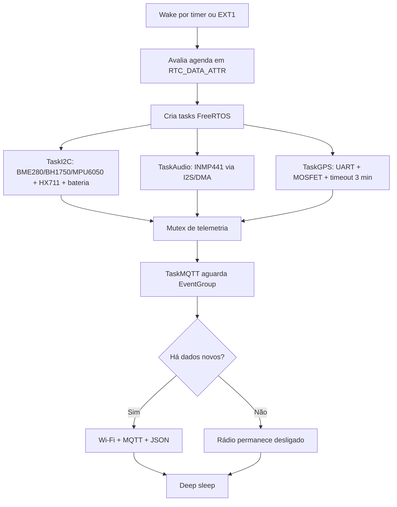

<div align="center">
🐝 # BeeSpace Firmware ESP32-S3


Firmware de produção para o biossensor inteligente de colmeias BeeSpace, com telemetria ambiental, acústica, peso, fluxo de abelhas e geolocalização antifurto.

</div>

---

## ✨ Visão geral

O firmware usa **PlatformIO**, **Arduino Framework**, **FreeRTOS**, **MQTT** e **ArduinoJson** para operar um nó IoT alimentado por bateria. O ESP32-S3 acorda por temporizador de 15 minutos ou por interrupção EXT1, coleta somente os dados necessários, liga o rádio Wi-Fi apenas quando existe telemetria nova e retorna ao deep sleep.

### Principais recursos

A integração do **GPS NEO-6M** foi desenhada para rastreamento de furtos sem comprometer a autonomia: o módulo é alimentado por um MOSFET controlado pelo GPIO 7 e só é ligado quando a posição é realmente necessária.

## Arquitetura de execução


## 🧭 Pinout sugerido

| Bloco | Periférico | Função | GPIO ESP32-S3 | Observações de produção |
|---|---|---:|---:|---|
| I2C | BME280 / BH1750 / MPU6050 | SDA | GPIO 8 | Pull-up externo típico de 4,7 kΩ para 3V3. |
| I2C | BME280 / BH1750 / MPU6050 | SCL | GPIO 9 | Barramento configurado em 400 kHz. |
| I2S | INMP441 | SCK / BCLK | GPIO 12 | Entrada de áudio com DMA. |
| I2S | INMP441 | WS / LRCLK | GPIO 13 | Canal mono. |
| I2S | INMP441 | SD / DOUT | GPIO 14 | Amostras de 32 bits. |
| EXT1 | TCRT5000 catraca entrada | Digital wake | GPIO 4 | Contador preservado em RTC RAM. |
| EXT1 | TCRT5000 catraca saída | Digital wake | GPIO 5 | Debounce por ISR. |
| EXT1 | MPU6050 | INT | GPIO 6 | Wake crítico para suspeita de furto/tombamento. |
| GPS | NEO-6M | GPS_EN / MOSFET gate | GPIO 7 | HIGH liga o GPS; LOW corta VCC no deep sleep. |
| GPS | NEO-6M | UART RX do ESP32-S3 | GPIO 43 | Conectar ao TX do GPS. |
| GPS | NEO-6M | UART TX do ESP32-S3 | GPIO 44 | Conectar ao RX do GPS, se usado. |
| Peso | HX711 | DOUT | GPIO 16 | Célula de carga. |
| Peso | HX711 | SCK | GPIO 17 | `power_down()` após leitura. |
| Energia | Divisor resistivo | ADC bateria | GPIO 1 | ADC1 com atenuação de 11 dB. |
| Status | LED opcional | Saída | GPIO 21 | Remover ou desabilitar para consumo mínimo. |
> Evite GPIOs de strapping/boot para periféricos críticos e valide a pinagem real da sua placa ESP32-S3 DevKitC-1 antes de fabricar o PCB.

## Estratégia agressiva de Deep Sleep

A BeeSpace opera com um **tick RTC de 15 minutos** preservado em `RTC_DATA_ATTR`. Wakes por timer avançam a agenda periódica; wakes por EXT1 são tratados como eventos assíncronos e não antecipam leituras pesadas desnecessárias.

Principais decisões de energia:

- **Wi-Fi sob demanda:** o rádio só é ativado pela `TaskMQTT` quando há dados frescos, contagem de catraca, GPS ou alerta de furto.
- **Contadores em RTC RAM:** os totais das catracas TCRT5000 sobrevivem ao deep sleep sem depender de flash.
- **EXT1 para eventos críticos:** GPIOs 4, 5 e 6 acordam o ESP32-S3 para fluxo de abelhas ou suspeita de furto.
- **GPS com MOSFET:** módulos como NEO-6M podem consumir dezenas de mA mesmo sem fix. Por isso o GPIO 7 controla um MOSFET que corta o VCC do GPS durante deep sleep.
- **GPS com política restritiva:** a `TaskGPS` liga o MOSFET somente a cada 24 horas ou imediatamente quando o wake EXT1 veio do INT do MPU6050.
- **Timeout de 3 minutos:** se não houver fix válido, o firmware desliga o GPS, marca `gps.timeout=true` no JSON e libera o fluxo para publicação e retorno ao deep sleep.

## Payload MQTT
O payload JSON inclui seções condicionais para reduzir bytes transmitidos:

- `environment`: temperatura, umidade, pressão, altitude barométrica e luminosidade.
- `audio`: RMS, pico e taxa de cruzamento por zero.
- `scale`: peso da colmeia.
- `imu`: aceleração e giroscópio.
- `bee_counter`: totais e contagens da sessão.
- `gps`: fix, timeout, satélites, idade do fix, latitude, longitude, altitude, velocidade e curso.
- `health`: flags de sanidade dos sensores, incluindo `gps_timeout`.
- `alert`: alerta antifurto e total acumulado de eventos.

## Dependências

As bibliotecas são instaladas pelo PlatformIO via `lib_deps`:

| Categoria | Bibliotecas |
|---|---|
| JSON/MQTT | ArduinoJson, PubSubClient |
| GPS | TinyGPSPlus |
| Sensores I2C | Adafruit BME280 Library, Adafruit MPU6050, Adafruit Unified Sensor, BH1750 |
| Peso | HX711 |
| Sistema | Arduino Core ESP32, FreeRTOS, driver I2S, ESP-IDF sleep APIs |

## Compilação via CLI

1. Instale o PlatformIO Core.
2. Entre na pasta do firmware.
3. Compile o ambiente do ESP32-S3.


```bash
cd firmware/esp32-s3
pio run
```

Para acompanhar logs seriais após gravar a placa:

```bash
pio device monitor -b 115200
```
## Checklist de campo

- [ ] Calibrar `HX711_CALIBRATION_FACTOR` e `HX711_OFFSET` com peso conhecido.
- [ ] Validar o divisor resistivo de bateria e a curva `batteryPercentFromVoltage()`.
- [ ] Confirmar polaridade do MOSFET: `GPS_EN_PIN` HIGH deve alimentar o GPS e LOW deve cortar VCC.
- [ ] Testar cold start e warm start do NEO-6M em céu aberto.
- [ ] Confirmar que o INT do MPU6050 acorda via EXT1 e dispara publicação crítica com GPS.
- [ ] Substituir credenciais simuladas de Wi-Fi/MQTT por provisioning seguro.
- [ ] Medir consumo real em deep sleep, captura de áudio, fix GPS e transmissão MQTT.
- [ ] 
---

<div align="center">

**BeeSpace** — biossensoriamento inteligente e rastreável para colmeias conectadas.

</div>
