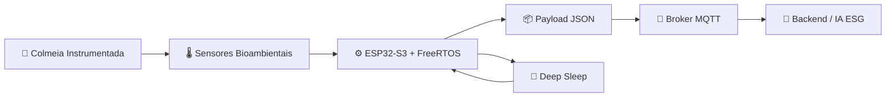

<h1 align="center">🐝 BeeSpace Hardware Lab — Simulação Wokwi</h1>

<p align="center">
  <strong>Biodiversidade em Órbita: transformando colmeias tradicionais em biossensores inteligentes para bioindicadores e inteligência de mercado ESG.</strong>
</p>

<p align="center">
  
  
  
  
  
</p>

---

## 🌌 Visão Geral

A pasta `firmware/wokiwi/` concentra o laboratório virtual de hardware do **BeeSpace**, uma simulação do circuito embarcado da colmeia inteligente na plataforma **Wokwi**. O objetivo é validar, de forma rápida e reprodutível, a arquitetura de sensores, comunicação e energia antes da prototipagem física.

Nesta simulação, o **ESP32-S3** executa firmware em **C++/Arduino** com **FreeRTOS**, separando responsabilidades em tarefas dedicadas para leitura sensorial, publicação MQTT e gerenciamento agressivo de energia.


> [!IMPORTANT]
> Este ambiente foi pensado como uma bancada digital de validação: o código mantém a aplicação operando mesmo quando algum sensor não está presente no laboratório/simulador, gerando leituras plausíveis para preservar o fluxo completo de telemetria.

---

## 📚 Índice

- [🌌 Visão Geral](#-visão-geral)
- [🧠 Arquitetura da Simulação](#-arquitetura-da-simulação)
- [🧩 Tabela de Componentes](#-tabela-de-componentes)
- [🔁 Fluxo de Operação](#-fluxo-de-operação)
- [📡 Comunicação MQTT](#-comunicação-mqtt)
- [🔋 Gerenciamento de Energia](#-gerenciamento-de-energia)
- [🚀 Como Rodar a Simulação](#-como-rodar-a-simulação)
- [🗂️ Estrutura da Pasta](#️-estrutura-da-pasta)
- [🧪 Trechos de Referência](#-trechos-de-referência)
- [🛠️ Próximos Passos](#️-próximos-passos)

---

## 🧠 Arquitetura da Simulação

O firmware simulado representa o nó de borda instalado em uma colmeia instrumentada. Ele coleta sinais ambientais, acústicos, mecânicos e de movimento, empacota a telemetria em **JSON** e publica os dados via **MQTT** para posterior análise por serviços de IA e inteligência ESG.



### Núcleo embarcado

- **Microcontrolador:** ESP32-S3.
- **Sistema operacional:** FreeRTOS com tarefas separadas para sensores, MQTT e power management.
- **Comunicação:** Wi-Fi + MQTT com payload JSON.
- **Energia:** bateria LiPo 3.7V, painel solar, módulo BMS e política de deep sleep.
- **Antifurto:** combinação de movimento inercial via MPU6050 e deslocamento por GPS.

---

## 🧩 Tabela de Componentes

| Componente | Protocolo / Interface | Dados coletados | Função na colmeia inteligente |
|---|---:|---|---|
| **ESP32-S3** | Wi-Fi, GPIO, I2C, I2S, UART, ADC | Coordenação do sistema | Nó de borda responsável por orquestrar sensores, tarefas FreeRTOS, conectividade e economia de energia. |
| **BME280** | I2C | Temperatura, umidade e pressão atmosférica | Monitora microclima interno/externo da colmeia para identificar estresse térmico e condições ambientais críticas. |
| **BH1750** | I2C | Luminosidade em lux | Mede exposição luminosa, auxiliando correlações com atividade das abelhas e condições do entorno. |
| **INMP441** | I2S | Áudio digital, RMS e pico | Captura assinatura acústica da colmeia para detecção de padrões anômalos de atividade. |
| **HX711 + célula de carga** | GPIO dedicado / serial síncrono | Peso da colmeia | Estima massa de mel, população e variações bruscas associadas a manejo, enxameação ou eventos externos. |
| **TCRT5000** | GPIO digital | Entrada/saída por reflexão infravermelha | Apoia a contagem de fluxo de abelhas na entrada da colmeia. |
| **MPU6050** | I2C | Aceleração e giroscópio | Detecta vibração, inclinação e movimentação suspeita para antifurto. |
| **Módulo GPS** | UART | Latitude, longitude e fix | Valida geolocalização da colmeia e dispara alerta em caso de deslocamento inesperado. |
| **Painel solar** | Entrada de energia | Geração simulada | Representa a recarga em campo para operação autônoma. |
| **BMS + LiPo 3.7V** | Alimentação / ADC | Tensão da bateria | Protege a bateria e informa a política de transmissão e sono profundo. |

> [!NOTE]
> A simulação foca a lógica de sistema e integração. Valores elétricos finos, proteção contra ruído, layout PCB e calibrações definitivas devem ser validados em bancada física.

---

## 🔁 Fluxo de Operação

1. **Wake-up:** o ESP32-S3 desperta do modo de baixo consumo.
2. **Inicialização:** barramentos I2C, I2S, UART, GPIO e ADC são configurados.
3. **Aquisição:** a task de sensores coleta microclima, luminosidade, áudio, peso, fluxo infravermelho, IMU, GPS e bateria.
4. **Análise local:** o firmware calcula indicadores imediatos, como RMS de áudio e alerta antifurto.
5. **Publicação:** a task MQTT conecta no Wi-Fi, cria o payload JSON e publica no tópico configurado.
6. **Economia extrema:** a task de power management encerra o ciclo e chama `esp_deep_sleep_start()`.

---

## 📡 Comunicação MQTT

A telemetria é enviada como JSON para facilitar integração com gateways, data lakes, dashboards ESG e pipelines de IA.

Exemplo simplificado do payload:

```json
{
  "device_id": "beespace-hive-001",
  "timestamp": 1717000000,
  "sensors": {
    "bme280": { "t": 31.2, "h": 62.5, "p": 1012.8 },
    "bh1750": 420.0,
    "hx711": 39.7,
    "tcrt5000": 1,
    "inmp441": 0.08,
    "gps": { "lat": -23.55, "lon": -46.63, "fix": true }
  },
  "status": {
    "batt_v": 3.91,
    "mode": "normal",
    "theft_alert": false
  }
}
```

---

## 🔋 Gerenciamento de Energia

A arquitetura simula uma colmeia remota com alimentação solar e bateria **LiPo de 3.7V**. O firmware evita transmissões quando a tensão está baixa e utiliza deep sleep para reduzir drasticamente o consumo entre ciclos de coleta.

```cpp
esp_sleep_enable_timer_wakeup(DEEP_SLEEP_SECONDS * 1000000ULL);
Serial.flush();
esp_deep_sleep_start();
```

> [!TIP]
> Em campo, ajuste `DEEP_SLEEP_SECONDS`, o divisor resistivo do ADC e o limiar mínimo de publicação conforme a capacidade do painel solar, bateria e frequência desejada de telemetria.

---

## 🚀 Como Rodar a Simulação

### Opção 1 — Pelo navegador no Wokwi

1. Acesse [https://wokwi.com](https://wokwi.com).
2. Crie um novo projeto para **ESP32-S3** ou abra um projeto existente.
3. Importe/cole o conteúdo do arquivo `diagram.json` da pasta `firmware/wokiwi/` no editor de diagrama do Wokwi.
4. Copie o firmware da pasta para o arquivo principal do projeto Wokwi.
5. Configure, se necessário, as credenciais Wi-Fi e MQTT simuladas no código.
6. Clique em **Start Simulation** e acompanhe os logs no monitor serial.

### Opção 2 — Usando VS Code + extensão Wokwi

1. Instale a extensão **Wokwi for VS Code**.
2. Abra o repositório `BeeSpace` no VS Code.
3. Navegue até `firmware/wokiwi/`.
4. Abra o arquivo `diagram.json` pela extensão.
5. Inicie a simulação pelo painel do Wokwi.
6. Observe a telemetria serial, os ciclos FreeRTOS e a transição para deep sleep.

> [!WARNING]
> Caso o arquivo `diagram.json` ainda não esteja no clone local, use a imagem `wokiwi.png` como referência visual do circuito e recrie o diagrama no editor Wokwi antes de iniciar a simulação.

---

## 🗂️ Estrutura da Pasta

```text
firmware/wokiwi/
├── README.md      # Documentação da simulação de hardware
├── code           # Firmware ESP32-S3 com FreeRTOS, sensores, MQTT e deep sleep
└── wokiwi.png     # Imagem do esquema de hardware no Wokwi
```

---

## 🧪 Trechos de Referência

### Criação das tasks FreeRTOS

```cpp
xTaskCreatePinnedToCore(taskSensors, "taskSensors", 8192, nullptr, 2, nullptr, 1);
xTaskCreatePinnedToCore(taskMQTT, "taskMQTT", 8192, nullptr, 1, nullptr, 0);
xTaskCreatePinnedToCore(taskPowerManagement, "taskPowerManagement", 4096, nullptr, 3, nullptr, 0);
```

### Função do nó de borda

```cpp
// The application is task-driven. The power task will enter deep sleep.
void loop() {
  vTaskDelay(pdMS_TO_TICKS(1000));
}
```

---

## 🛠️ Próximos Passos

- [ ] Versionar o `diagram.json` exportado do Wokwi para tornar a simulação totalmente reproduzível.
- [ ] Documentar pinagem definitiva em tabela elétrica com tensão, pull-up/pull-down e observações de ruído.
- [ ] Adicionar cenários de teste: bateria baixa, ausência de GPS, roubo simulado e variação brusca de peso.
- [ ] Integrar dashboards de telemetria para validação do payload MQTT em tempo real.
- [ ] Evoluir o modelo antifurto com fusão entre IMU, GPS e padrões acústicos.

---

<p align="center">
  <strong>BeeSpace</strong> — tecnologia embarcada para transformar biodiversidade em inteligência ambiental confiável.
</p>
