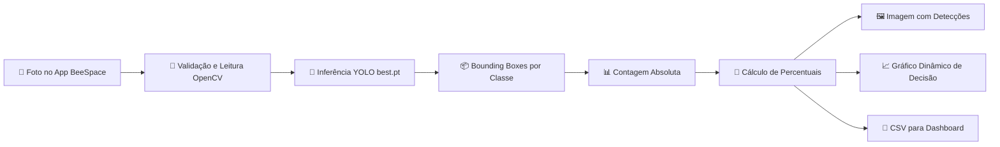

# 👁️ BeeSpace - Visão Computacional & Manejo Inteligente


> **Do clique no celular ao laudo técnico em segundos:** este módulo transforma imagens de favos em inteligência operacional para o apicultor moderno.

---

## 🚀 O Problema e a Solução

A avaliação visual de um favo normalmente depende da experiência do apicultor, da iluminação no campo e de uma leitura subjetiva do estado da colmeia. O módulo de Visão Computacional do **BeeSpace** converte essa observação humana em um **laudo quantitativo, rastreável e padronizado**, detectando alvéolos com **mel, néctar, pólen, ovos, larvas e crias operculadas** por meio de um modelo YOLO treinado com dataset anotado no Roboflow.

O resultado é uma base objetiva para tomada de decisão: identificar força da colônia, disponibilidade de alimento, sinais de rainha ativa, desenvolvimento da cria e necessidade de manejo preventivo antes que perdas produtivas aconteçam.

---

## 🧬 Dicionário de Classes

| Classe | Ícone | O que representa | Interpretação para a saúde da colmeia |
|---|---:|---|---|
| **Mel** (`mel`) | 🍯 | Alvéolos com reserva de mel maduro. | Indica estoque energético e capacidade de sustentar a colônia em períodos de menor florada. |
| **Néctar** (`nectar`) | 💧 | Néctar recém-coletado ainda em processamento. | Sinaliza fluxo de alimento ativo e atividade de forrageamento recente. |
| **Pólen** (`polen`) | 🌼 | Pólen armazenado como fonte proteica. | Essencial para nutrição das larvas; bons níveis sugerem suporte adequado à criação. |
| **Ovos** (`ovos`) | 🥚 | Postura recente da rainha. | Evidência de rainha ativa e renovação populacional em andamento. |
| **Larvas** (`larvas`) | 🐛 | Estágio aberto de desenvolvimento da cria. | Mostra progressão do ciclo reprodutivo e demanda nutricional elevada. |
| **Crias Operculadas** (`crias_operculadas`) | 🧱 | Alvéolos fechados com pupas em desenvolvimento. | Indica população futura próxima de emergir e ajuda a estimar crescimento da colônia. |

---

## 🧠 Pipeline Técnico



### Saídas geradas

Para cada imagem processada, o pipeline salva:

- **Imagem anotada** com bounding boxes detectadas (`*_bounding_boxes.jpg`).
- **Gráfico percentual** da composição do favo (`*_laudo_percentual.png`).
- **CSV quantitativo** com contagens e percentuais (`*_laudo_quantitativo.csv`).

---

## 📁 Estrutura esperada

```text
visao.computacional/
├── CODIGO.ML.VC.py
├── README.md
├── best.pt                 # peso treinado YOLO, não versionar se for grande/sensível
├── exemplos/
│   └── favo_teste.jpg
└── outputs/
    ├── favo_teste_bounding_boxes.jpg
    ├── favo_teste_laudo_percentual.png
    └── favo_teste_laudo_quantitativo.csv
```

---

## ⚙️ Instalação

> Recomendado: usar um ambiente virtual dedicado ao projeto.

```bash
cd BeeSpace/visao.computacional
python -m venv .venv
source .venv/bin/activate  # Windows: .venv\Scripts\activate
pip install --upgrade pip
pip install ultralytics opencv-python pandas matplotlib
```

### Dependências principais

| Biblioteca | Papel no módulo |
|---|---|
| `ultralytics` | Carregamento e inferência do modelo YOLO treinado. |
| `opencv-python` | Leitura de imagens e escrita da imagem anotada. |
| `pandas` | Estruturação do laudo quantitativo. |
| `matplotlib` | Geração do gráfico visual para decisão rápida. |

---

## ▶️ Uso Rápido

Execute o script apontando para o modelo treinado (`best.pt`) e para uma foto de favo:

```bash
python CODIGO.ML.VC.py \
  --model best.pt \
  --image exemplos/favo_teste.jpg \
  --output-dir outputs \
  --conf 0.25 \
  --imgsz 1024
```

Exemplo de saída no terminal:

```text
=== Laudo Quantitativo BeeSpace ===
          classe  contagem  percentual
             mel        42       35.00
          nectar        18       15.00
           polen        12       10.00
            ovos        10        8.33
          larvas        16       13.33
crias_operculadas        22       18.33

Artefatos gerados:
- Imagem anotada: outputs/favo_teste_bounding_boxes.jpg
- Gráfico percentual: outputs/favo_teste_laudo_percentual.png
- CSV quantitativo: outputs/favo_teste_laudo_quantitativo.csv
```

---

## 🧪 Validação local sem inferência real

Para conferir argumentos e estrutura do CLI:

```bash
python CODIGO.ML.VC.py --help
```

Para validar a sintaxe do arquivo:

```bash
python -m py_compile CODIGO.ML.VC.py
```

---

## 🏭 Boas práticas para produção

- **Versione metadados do modelo**: registre data de treinamento, versão do dataset Roboflow, métricas de validação e threshold recomendado.
- **Controle iluminação e foco**: fotos de campo com sombra, baixa nitidez ou ângulo extremo podem reduzir precisão.
- **Monitore drift**: floradas, regiões e raças de abelhas diferentes podem mudar o padrão visual dos favos.
- **Use amostragem por apiário**: compare laudos entre caixas e inspeções para detectar tendências, não apenas uma foto isolada.
- **Integre com telemetria**: combine o laudo visual com peso da caixa, temperatura, umidade e histórico climático do BeeSpace.

---

## 🧭 Roadmap técnico

- [ ] Calcular área ocupada por classe usando pixels das bounding boxes, além da contagem absoluta.
- [ ] Exportar laudos em PDF para compartilhamento com técnicos e cooperativas.
- [ ] Criar endpoint FastAPI para consumo direto pelo app mobile.
- [ ] Adicionar rastreamento de experimento com MLflow ou Weights & Biases.
- [ ] Incorporar segmentação para estimativas mais finas por alvéolo.

---

## 🐝 Impacto esperado

Com o BeeSpace, a inspeção deixa de ser apenas visual e passa a ser **data-driven**. O apicultor ganha uma leitura objetiva da colmeia, técnicos conseguem comparar apiários em escala e o manejo passa a ser orientado por evidências mensuráveis.
